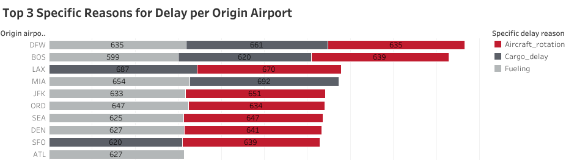
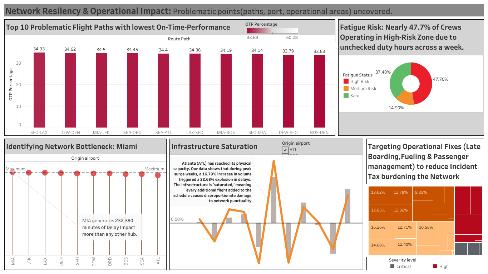

# Aviation Operations Analysis: Aurora Pacific Airways resilience Audit 
 A SQL driven diagonstic analysis of the existing flight operation data comprising for scheduling, crew bases, crew and incidents. Excel has been leveraged for data pre-processing, SQL for surfacing business questions and Tableau for executive-level storytelling, this project transforms 120k+records into a proactive risk management framework. 

## **Project Background**
Aurora Pacific Airways, is a low cost carrier in the United States, with its primary hub is San Franciso, serving Boston(BOS), Atlanta(ATL), Denver(DEN), SeattleSEA), Dallas Fort Worth(DFW), Los Angeles(LAX), Miami(MIA), New York City(JFK) and Chicago(ORD). In 2024, Aurora Pacific Airways (APA),  hit a critical operational plateau. Despite increasing flight volumes, the network began experiencing rising volatility and a noticeable degradation in On-Time Performance (OTP). The airline's leadership recognized that the existing schedule was no longer capable of absorbing minor shocks, but they lacked a unified view of where and how operational minutes were being lost.

To prevent system-wide failure, the Operations Department commissioned this diagnostic audit across four critical areas:
- **1)Network Operations:** To identify where the network is physically "hemorrhaging" minutes and pinpoint seasonal failure points.
- **2)Crew Logistics:** To evaluate crew base performance and identify role-based friction that prevents on-time departures.
- **3)Safety & Vulnerability:** To analyze the relationship between procedural safety and operational reliability.
- **4)Infrastructure Management:** To determine which airports of the APA network have reached a point of physical saturation.

**The Goal:** Shift from "Reactive Firefighting" to "Proactive Resilience"—reclaiming lost minutes and bulletproofing the 2025 schedule.

- The log to record all the cleaning process in Excel can be found here [Link](CleaningLog.md)
- The SQL queries used to inspect the data for its quality for this analysis can be found here [Link](DataQualityCheckSQL.md)
- Targed SQL queries regarding various business questions can be found here [Link](SQLqueries.md)

**4 Interactive Tableau dashboards for the 4 groups of Stakeholders in the Operations Department of Aurora Pacific Airways can be found below:**
- **For Network Planning & Scheduling Stakeholder ->** to help them design a flight schedule that is time efficient and reliable, the dashboard can be found here <a href="https://public.tableau.com/app/profile/cynthia.napoleon/viz/Flight_Operations_AuroraPacificAirways/Dashboard1">[link]<a>
- **For Crew Logistics & Resource Management ->** to help them makes changes to ensure right people are at the right time without burning them out, the dashboard can be found here <a href="https://public.tableau.com/app/profile/cynthia.napoleon/viz/Flight_Operations_AuroraPacificAirways/Dashboard2">[link]<a>
- **For Safety and Compliance ->** to help them create plans that minimise operational risk and ensure procedural adherance, the dashboard can be found here <a href="https://public.tableau.com/app/profile/cynthia.napoleon/viz/Flight_Operations_AuroraPacificAirways/Dashboard3">[link]<a>
- **For Ground Operations & Infrastructure ->** to help them manage the physical "turn" of the aircraft and hub capacity, the dashboard can be found here <a href="https://public.tableau.com/app/profile/cynthia.napoleon/viz/Flight_Operations_AuroraPacificAirways/Dashboard4">[link]<a>

## **Data Structure & Initial Checks**
The companies main database structure as seen below consists of three tables: Flight Operations(FlightOps), Crew Scheduling(Crew_scheduling), and Crew Incidents(Crew_incidents) with a total row count of 1,20,902 records. A description of each table is as follows:

## **Executive Summary**
**Overview of Findings**
The 2024 Audit reveals an airline operating at a breaking point, with systemic fragility causing resiliency to plummet during seasonal peaks. While ORD emerged as the "Resiliency King" with an elite 78.49% recovery rate, the broader network is hemorrhaging time due to a staggering 40,710-minute "Operational Tax"—a figure equivalent to grounding three full aircraft for an entire month.

The audit identifies several critical failure points:
- **Infrastructure Saturation:** At core hubs like ATL, delays have spiked 35% faster than flight volume, proving the system has reached a physical ceiling.
- **The Second Officer Bottleneck:** Operational stability sank to its lowest point during junior flight-deck delays; a single late sign-in triggers a 79-minute system lag—the most lethal role-based delay in the fleet.
- **Human Capital Depletion:** A major risk factor was uncovered in crew health, with 47.7% of the workforce categorized as "High Risk" for fatigue, fueling the sick calls that account for 58% of all safety-related time loss.
- **The March Stress Spike:** Safety performance dipped to an annual low in March, which alone accounted for 22% of all yearly incidents.
The Domino Effect: Ground efficiency in laggard bases has hit a trough, "leaking" 5 minutes per turn and triggering mandatory overnight groundings at SFO due to the 18:00 "Breaking Point.”

# **Insights Deep Dive**

## Area 1: Network Operations (Network Congestion Audit)
- **A) The "Turnaround" Trap: Network-Wide Delay Propagation**\
Our operational efficiency is currently hindered by a systemic "knock-on" effect. Aircraft Rotation (late incoming flights) is a primary bottleneck across our network, appearing as a
top-three delay reason at 80% of our major hubs (8 out of 10). It accounts for 26.8% of all high-frequency delay occurrences (5,156 instances) in this dataset. With an average delay of
29.1 minutes per occurrence, these rotation delays represent a network-wide instability rather than isolated terminal issues.
To improve the situation, focus should be on improving turnaround buffers and gate management at the 8 identified hubs. Reducing rotation-related delays by even 10% would reclaim approximately 2,500 minutes of flight time per cycle, preventing single late arrivals from cascading into day-long schedule disruptions.

- **B) The "Chronic Five": Identifying Fleet-Wide Reliability Outliers:**\
A full-year analysis reveals that fleet instability is driven by a specific group of persistent "bad
actors" rather than random external events. While the fleet averages 6.4 cancellations per
month, a subset of five aircraft—N0109QX, N0089QX, N0078QX, N0055QX, and
N0052QX—remained in a "High Risk" state (exceeding 8 monthly cancellations) for 50% of
the year, accounting for 474 total cancellations in 2024. This frequency of alert indicates a
systemic failure in the maintenance lifecycle rather than isolated incidents, with their
collective 15% cancellation rate nearly doubling the fleet norm. To protect passenger
revenue and stabilize the network, we must move these "Chronic Five" from reactive repairs
to an accelerated heavy-maintenance overhaul, a move that would theoretically prevent over
100 cancellations annually.

- **C) Capacity Drain:: Reclaiming Revenue Time from "Sluggish" Hubs:**\
Ground operations at BOS and ORD are currently the primary drivers of fleet
underutilization, with turnaround times encroaching most heavily on potential flying capacity.
While the network average variance is -73.1, BOS leads the "sluggish" list with a variance of
-69.4, meaning its ground stay is nearly 5 minutes longer than our most efficient hub, ATL
(-75.6). This efficiency gap represents a significant hidden capacity: if BOS and ORD
improved their ground processes to simply match the fleet average, we would reclaim
approximately 3-4 minutes of flight availability per rotation. Stakeholders should prioritize a
ground-handling audit at these high-variance hubs to convert "idle gate time" back into
"revenue-generating air time."
- **D) Network Vulnerability: The 18:00 System Fatigue:**\
 Our network reaches its maximum operational vulnerability at 18:00 (6:00 PM), a window
we’ve identified as the true "System Sickness" hour because delays reach their daily peak of
25.92 minutes despite flight volume (3,714) being lower than the morning rush (3,822). This
revelation is weighty because it proves our evening delays are not caused by traffic density,
but by cumulative network fatigue—a structural inability to recover from morning disruptions
that carry over and compound into a brittle, pre-stressed environment by nightfall. To resolve
this, we must implement a "Mid-day Operational Reset" between 1:00 PM and 3:00 PM; by
strategically increasing buffers during this lower-volume window to clear residual stress, we
can prevent the 6:00 PM breaking point and reclaim an estimated 2-3 minutes of flight time
per evening rotation.

- **E) The "Resiliency Champion": ORD’s Superior Schedule Recovery:**\

Our analysis identifies Chicago O'Hare (ORD) as the network’s leader in operational
resiliency, successfully "catching up" the schedule for 78% of its delayed flights. While the
fleet average for recovery is roughly 75%, ORD’s performance stands in stark contrast to
SFO, which sits at the bottom of the ranking with a 73% recovery rate. This 5% efficiency
gap is a critical differentiator: it suggests that ORD has mastered the "tactical turn," using
ground buffers and optimized gate flows to absorb delays that other hubs like SFO pass
directly through to the next leg. To stabilize the broader network, we should investigate
ORD's specific ground-handling protocols—such as their "pre-departure sequencing" or
"gate-side maintenance agility"—and export these best practices to lower-performing
stations like SFO and JFK to prevent delay propagation.
- **F)The "Wild Card" Route: Managing the Volatility of SFO-LAX:**\
Our "Volatility Matrix" reveals that SFO-LAX is one of the most unpredictable segments in
the network, categorized as a "High-Risk Wild Card" due to its combination of high average
delays (26.1 minutes) and high variance (19.6 standard deviation). While some routes have
long delays that are at least consistent, SFO-LAX exists in the dangerous "Upper-Right
Quadrant," meaning its performance fluctuates wildly day-to-day, making it nearly impossible
for passengers or crew to plan accurately. This volatility is a significant operational drain; the
lack of predictability forces the airline to carry excess "buffer" fuel and staffing costs to cover
the wide range of possible outcomes. To stabilize this route, we should transition from static
scheduling to "Dynamic Buffer Allocation"—specifically increasing the scheduled block time
by 5 minutes for this specific leg to move it out of the high-volatility zone and improve our
on-time predictability.

## Area 2: Crew Logistics (Workforce Constraints)
- **A) Base Efficiency Benchmarking: Maximizing Crew Utilization:**\
Our network efficiency is not uniform, with a clear performance gap between our top-tier and
bottom-tier crew bases. Denver (DEN) emerges as our efficiency leader with a negative duty
variance of -0.05 hours, meaning their crews consistently complete rotations faster than the
company average. On the other end of the spectrum, the UNK (unassigned/transient) base
shows the highest inefficiency at +0.07 hours above the benchmark. This total delta of 0.12
hours (7.2 minutes) per crew duty may seem marginal, but when multiplied across
thousands of monthly rotations, it represents a significant drain on labor productivity. To
recapture this lost time, we should treat DEN as the "Center of Excellence" and perform a
deep-dive into their briefing and debarkation workflows to standardize these efficiencies
across the lagging bases.
- **B) Human Capital Friction: Addressing the "Captain's Bottleneck":**\
The analysis of start-of-day friction across different professional groups identifies Captains
as facing the most significant obstacles, with an average start delay of 29.05 minutes. While
Second Officers begin their duties with the least friction (27.44 minutes), the Captain's role
remains the critical path for the entire flight operation. This 1.61-minute gap between the
highest and lowest friction roles highlights a systemic inefficiency in the specialized briefing
or security protocols required for flight commanders. Since a Captain's readiness is the legal
requirement for an aircraft to push back, this friction acts as a direct throttle on network
punctuality. Reducing Captain-specific sign-in delays to match even the First Officer's level
(28.55 min) would create a more synchronized flight deck and remove a primary human
obstacle to achieving a sharp, on-time departure.
- **C) Idle Time Risk: High-Cost Layovers in SFO and SEA:**\
Our network currently holds 499 instances of layovers exceeding 24 hours, representing a
significant concentration of "Idle Time" where the company is paying for hoteling and
per-diems rather than active flight production. The analysis identifies San Francisco (SFO)
and Seattle (SEA) as the primary risk centers, accounting for 95 and 91 long-layover
instances respectively. These two bases alone represent nearly 37% of our high-cost idle
time. By re-optimizing crew pairings specifically out of the West Coast hubs to reduce these
24h+ gaps, we can significantly lower non-operational labor costs without impacting flight
frequency
- **D) Workload Equity Gap: Addressing the "Burnout Risk" at ORD:**\
Our assessment of workload distribution for Cabin Crew identifies Chicago O’Hare (ORD) as
the primary outlier for potential burnout and labor dissatisfaction. ORD shows the highest
Workload Range of 12.61 hours, significantly higher than the network low of 11.50 hours
(found in JFK and SFO, excluding unassigned groups). This means that within the same
crew base, some employees are flying nearly 13 more hours than their peers in a single
cycle. This extreme variance indicates a lack of schedule "smoothing" at ORD. By
re-distributing these "peak" duty hours more equitably across the 1,598 crew members at the
ORD base, we can reduce the risk of fatigue-related errors and improve overall employee
retention.

- **E) Shift Congestion Analysis: Debunking the "Morning Rush" Myth**\
Contrary to operational assumptions, the "Early Morning Rush" is not the primary driver of
our network delays. While it is a high-tempo period, it actually records the lowest average
delay in our system at 28.57 minutes. The true bottleneck is the Daytime Shift, which
exhibits both the highest volume (11,207 duty starts) and the highest average delay (28.92
minutes). This shift accounts for over 37% of our total daily activity. The synchronization of
peak volume with peak delay suggests that our ground infrastructure and gate capacity are
being overwhelmed during midday operations. To improve overall network health, we should
investigate shifting non-critical maintenance or training activities out of this "Daytime Peak"
to alleviate the strain on resources.

## Area 3: Safety & Vulnerability (Systemic Fragility)
- **A)Safety vs. Fatigue: Debunking the Workload-Exhaustion Link**\
A rigorous correlation of safety incidents against historical workloads reveals that crew
exhaustion is not the primary driver of our current safety risk profile. The data shows that
100% of recorded incidents occurred within the "Normal" Fatigue Risk Category, with a
network-wide average of only 9.58 duty hours in the seven days preceding an event. Even
our most severe incidents (Critical/High) occurred when crews had worked an average of
less than 10 hours per week—well below the industry threshold for chronic fatigue (typically
40+ hours). This suggests that our safety vulnerabilities are likely procedural or
environmental rather than physiological. Instead of focusing on workload reduction to
improve safety, the department should pivot toward auditing specific operational tasks and
cockpit/cabin procedures.
- **B) Network Safety Velocity: Volatility in Critical Incident Management:**\
Our analysis of monthly incident trends reveals that we are not yet successfully
"extinguishing" critical safety events; rather, we are managing them in a cyclical, volatile
pattern. While "Critical" incidents represent a small fraction of our total volume (3.8%), their
frequency oscillates between a low of 1 and a recurring peak of 5 incidents per month
(occurring in January, June, and November). Because these spikes reappear every 4–5
months, it suggests that the "lessons learned" from one critical event may not be
permanently integrated into the network's long-term safety DNA. To break this cycle, we
must move beyond reactive "event-based" responses and investigate the shared
environmental or operational triggers that cause these 5-incident clusters to resurface
periodically.
- **C)The Efficiency Paradox: High-Volume Friction vs. High-Severity Shocks:**\
Our network delay profile is split between two distinct operational threats. Sick Calls are the
primary "Volume Drain," costing the network 3,558 total minutes—the equivalent of losing
nearly 60 hours of operational time across 87 incidents. However, Human Factors represent
our most dangerous "Severity Shock." While they occur rarely (only 9 times), they carry a
network-high average delay of 60 minutes per event. This indicates that while staffing
reliability (Sick Calls) is our most frequent tax, our procedural failures (Human Factors) are
our most disruptive "show-stoppers." To stabilize the network, we must simultaneously
improve reserve crew depth and harden procedural guardrails to reduce the massive
recovery time required for human error.
- **D)Base Safety Health: Normalizing Risk vs. Volume:**\
By normalizing incidents against unique crew counts, we have identified SFO (7.37%) and
ORD (7.20%) as our primary risk hotspots. While these bases have high raw incident
counts, the normalized rate confirms that a crew member based in SFO is approximately
18% more likely to be involved in a safety event than a crew member based in LAX
(6.22%), our network "Safety Leader." The visual "break" at our center point (6.8%) reveals
a clear geographic divide: our Western (SFO/SEA) and Central (ORD/DEN) hubs are
currently operating above the network average risk, while our Coastal hubs (JFK/LAX) are
trending significantly safer. This suggests that the risk in SFO and ORD is not just a
byproduct of their large size, but a systemic operational friction that requires a targeted
safety culture audit
- **E) Operational Vulnerability: The Second Officer "Crisis Bottleneck":**\
Our analysis of role-based safety impact identifies the Second Officer as the most significant
operational vulnerability during a crisis. Specifically, while Second Officers have the lowest
frequency of incidents across the board, their Late Sign-in events trigger a massive network
disruption, averaging 79.38 minutes of delay—surpassing the critical 60-minute threshold
and outperforming the delay impact of Captains and First Officers by nearly 25 minutes. This
suggests that because Second Officers are often the "final piece" of a flight crew assembly,
their tardiness causes a disproportionate cascading delay, likely because replacement
logistics for this specific role are less agile than for Cabin Crew or senior pilots. We must
implement a "High-Priority Notification" protocol specifically for Second Officer sign-ins to
prevent these outlier delays from paralyzing the network.

## Area 4: Network Resiliency (Infrastructure Saturation)
- **A)The "Flip-of-the-Coin" Fallacy: A Systemic Collapse of Schedule Integrity:**\
Our network reliability audit has uncovered a critical "Schedule Integrity Gap" across our
primary hub-to-hub arteries. In routes like BOS to DEN (33.63\%) and DFW to SFO
(33.79\%), we have effectively moved past "poor performance" into a state where delays are
the default, not the exception. For a passenger on these top 10 routes, an on-time arrival is
statistically less likely than a coin flip; in fact, they are twice as likely to be delayed as they
are to arrive on schedule. This isn't just a series of isolated incidents—it is a "Normalized
Failure." By the time we hit the 35\% OTP floor, we have lost the ability to manage
passenger expectations or crew connections. We must immediately transition from
"monitoring" these routes to a "Schedule Reset," specifically auditing whether our current
"Block-Times" are based on theoretical flight speeds or the harsh reality of hub congestion.
- **B) The Miami Bottleneck: Identifying the Network's Single Point of Failure:**\
Our analysis of hub dependency and systemic risk identifies Miami (MIA) as the network's
primary "Single Point of Failure." MIA currently exerts the highest total pressure on the
network, accumulating 232,683 total minutes of disruption impact—nearly 8,400 minutes
more than our most resilient hub, Atlanta (ATL).
The critical vulnerability is not just the volume of impact, but the fact that MIA also carries the
highest Average Hub Delay (25.86 minutes) across the same connectivity footprint (9
destinations) as every other hub. This indicates that MIA is not suffering from a "Volume"
problem, but a "Velocity" problem. Because MIA sits at the top of our risk scale, any local
failure at this node has a disproportionate cascading effect on the entire system. To stabilize
the network, we must prioritize an infrastructure audit at MIA, as improving its turnaround
efficiency by just 2% would recover more network time than any other operational change
- **D) Infrastructure Saturation:ATL’s Infrastructural Ceiling:**\
The "Non-Linear Break": Our analysis of the Atlanta (ATL) hub reveals a critical "Saturation Point" where our physical
and operational infrastructure fails to scale with demand. In July (Roster Month 7), we
observed a 16.79% increase in flight volume, which triggered a disproportionate 22.68%
spike in total delays.
This 5.89% "Efficiency Gap" indicates that the hub has hit a non-linear breaking point.
Ideally, delay growth should track below or equal to volume growth; however, in July, every
1% of additional volume resulted in a 1.35\% surge in delays. This is the "Infrastructure
Tax"—a clear signal that our current gate capacity, baggage handling systems, or ground
staffing levels at ATL cannot absorb peak-season growth without a systemic breakdown in
performance. We are not just getting busier; we are getting significantly less efficient as we
grow, suggesting that further expansion at ATL without a physical infrastructure reset will
result in diminishing returns and brand erosion.
- **E) The "Invisible Friction": Quantifying the 40,710-Minute Incident Tax:**\
Our network sustainability audit reveals a hidden operational burden: a total "Incident Tax" of
40,710 minutes (equivalent to over 678 hours) lost annually to non-technical operational
disruptions. This is not a single failure point, but rather "system friction"—the sum of small,
recurring events that erode our on-time performance (OTP).
The most striking revelation is the fragmentation of risk. Unlike a hub failure that can be
pinpointed to one location, this friction is distributed across multiple categories. "Sick Calls"
represent the largest single "tile" in our mosaic, contributing 8.74% (3,558 minutes) to the
total tax. When combined with other "Human Capital" factors like Late Sign-ins (7.69%) and
Late Boarding (7.68%), we find that nearly 25% of our total network friction is driven by
workforce-related logistics rather than mechanical or environmental issues. This identifies a
clear opportunity: we can recover over 10,000 minutes of network time by optimizing crew
standby logistics and boarding procedures, without needing a single aircraft upgrade.

## Strategic Recommendations by Stakeholder Group:
- **1. Network Planning & Scheduling**\
Corridor Rehabilitation (BOS-DEN): Immediate intervention is required for the BOS-DEN flight path. With a 33.63% OTP, this route requires a schedule "padding" adjustment or a shift in aircraft rotation to prevent it from remaining the network's primary reliability failure.
Buffer Realignment: Implement a mandatory "Late-Day Buffer" for flights arriving after the 18:00 Breaking Point. By adding 15 minutes of scheduled ground time during this window, the department can reduce the 12% overnight grounding rate currently caused by the late-day delay spike.
- **2. Crew Logistics & Resource Management**\
Workload Equity Balancing: Redesign the bidding system at ORD to close the 12.61-hour Inequity Gap. By distributing duty hours more evenly, the department can lower the 47.7% High-Risk fatigue rate and reduce the resulting sick call volume that currently drains 3,558 minutes annually.
Role-Specific Redundancy: Introduce "Standby Second Officers" at high-friction hubs. Because a single Second Officer late sign-in scales into a 79-minute system lag (the highest in the network), providing junior flight-deck redundancy offers the highest ROI for delay mitigation.
- **3. Safety & Compliance**\
Procedural Standardization: Transition safety focus from "Fatigue Management" to "Procedural Discipline." Since 100% of incidents occurred under normal fatigue ratings, the department should launch a targeted training campaign to address the "Safety Culture Gap" at SFO, where incident rates are 18% higher than at LAX.
Seasonal Risk Mitigation: Deploy "Safety Task Forces" during the March Stress Spike. With 22% of all annual incidents occurring in this single month, heightened oversight is required during seasonal volume surges to maintain system stability.
- **4. Ground Operations & Infrastructure**\
Infrastructure Decoupling (ATL & MIA): Transition to a structural surge-management model at ATL, where delays are growing 35% faster than flight volume. Additionally, prioritize ground stability at MIA to protect the network from its 232,683-minute systemic ripple effect.
Efficiency Export (ORD/SFO Model): Formalize and export the "Quick Turn" protocols from ORD (78.49% recovery rate) to BOS and ORD. Standardizing these processes will stop the 5-minute-per-turn "time leakage" and recover lost capacity across the East Coast and Midwest corridors.

## Assumptions and Caveats
- **Data Lineage:** "UNK" (Unassigned) crew data is assumed to represent crews without a permanent base assignment rather than missing data.
- **Fatigue Thresholds:** Fatigue risk (47.7%) is based strictly on rolling 7-day duty hour totals. It does not account for individual rest quality.
- **Normalization:** All safety and delay rates were normalized by flight volume to allow for accurate comparisons between major hubs and smaller ports.
- **Incident Reporting:** This audit assumes a consistent reporting rate for "Critical" and "High" severity events across all regions.
